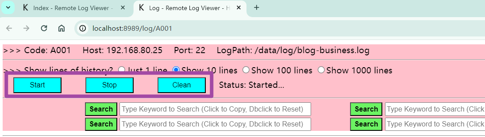
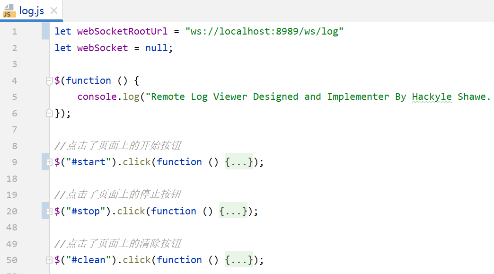
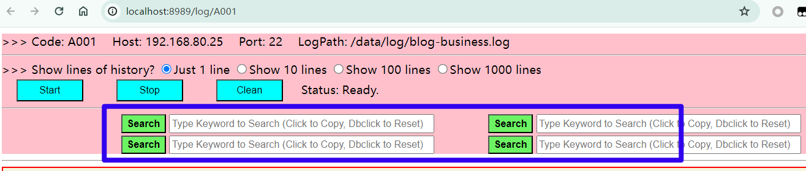

**一款简单易用的远程日志查看器，可实时查看云服务器上的日志数据**

**A SIMPLE and EFFECTIVE log viewer, which can load log data from a remote host log file in real time.**

# 项目背景

 **项目背景**

- 场景1：在企业级开发中，公司的测试环境一般部署在某个远程的内网服务器上，我们想要查看该个测试环境的日志，就需要手动建立SSH，再执行日志查看命令，在终端查看日志

- 场景2：我们自己写的小项目部署到云服务器上后，想要查看日志，也需要通过SSH连接到云服务器，通过执行文件查看命令，来看到日志信息

 **在这个过程中：**

1. 需要打开SSH客户端工具，例如MobaXterm、putty

2. 连接到远程服务器：输入密码、用户名

3. 手工键入日志文件查看命令：tail -f 日志文件路径

4. 在Shell Terminal查看日志

5.   存在问题：繁杂的重复操作，在Terminal上看得眼睛痛，不要根据关键字搜索日志，不好查看日志信息


> 以上是我司在内网测试环境，查看日志时的场景

**那么，有没有办法把这一过程自动化呢？答案是肯定的。这便是本项目的设计初衷与目的！**

# 功能特性

**功能特性列表**

- 支持打开**多个**的**前端页面**，**分别**抓取日志数据**渲染**到页面，但只能抓取一个日志文件的数据
- 可查看该日志文件的**历史数据**
- 可**实时**抓取日志文件中**新产生**的日志数据
- 对当前页面上的日志数据进行**关键字查询**
- 可在YML配置文件中**自定义SSH**服务地址和**日志文件**的位置

**后续将会支持的功能**

- 现阶段只**支持**获取文本文件中的日志数据，后续将可支持其他格式（例如**压缩文件**）的日志数据
- ……

> 展示所有自定义已经配置过了的日志抓取目标。点击ViewLog，跳转到该个目标的日志查看页面


> 支持打开**多个**的**前端页面**，**分别**抓取日志数据**渲染**到页面，但只能抓取一个日志文件的数据


> 可查看该日志文件的**历史数据**


> 可**实时**抓取日志文件中**新产生**的日志数据


**Start**：开始抓取日志文件中的历史记录，然后实时获取新产生的日志

**Stop**：停止抓取

**Clean**：清除当前页面上的所有日志数据，但不会断开连接，还是会实时地呈现后端推送过来的日志信息


> 对当前页面上的日志数据进行**关键字查询**


- 单击搜索框，将粘贴板上的数据复制到此个搜索框内

- 双击搜索框，清除此个搜索框内的数据

# 技术栈

**后端技术**

- Spring Boot

- SSH客户端的Java实现工具：jsch

- Spring封装的WebSocket Server API：将SSH中执行命令后返回的数据，推送给前端

**前端技术**

- jQuery

- JavaScript封装的WebSocket Client API：接收后端发来的数据，将其渲染到HTML页面

# 本地运行

**Step1：环境准备或检查**

- Java：11
- SpringBoot：2.3.12.RELEASE
- Apache Maven：3.6.3
- Chrome Version：108.0.5359.94，在地址栏输入（chrome://version/）可获取

**Step2：克隆项目到本地，从IDEA中打开，等待Maven自动配置完毕**

**Step3：填写项目的配置文件（application.yml），log.targets**

- 指定SSH的连接参数：host，port，username，password

- 远程服务器上的日志所在位置：logPath

**Step4：运行启动类**：src/main/java/com/hackyle/log/viewer/RemoteLogViewerApp.java

**Step5：** 进入Chrome，在地址栏输入：http://localhost:8989/ ，进入日志查看首页


# 设计说明

 **主要流程**

1.   **前端发起**一个WebSocket连接到后端

2.   连接建立成功后，**后端**通过**SSH连接到远程**服务器

3.   执行**日志文件查看命令**：tail -1f 日志文件的绝对路径，例如：tail -1f /data/blog.hackyle.com/blog-business-logs/blog-business.log

4.   **获取**到该个命令的执行**结果**，通过WebSocket**推送**到前端**页面**上

## 后端

### 从YML中注入日志目标的参数

**application.yml中定义日志目标参数**

```yaml
log:
  targets:
    - code: A001 #需要唯一标识此条记录
      host: 47.97.178.120 #SSH连接参数
      port: 22
      username: root
      password: hackyle.1916
      # 远程服务器上的日志文件的绝对路径
      # 例：/data/logs/app.log  #本质是执行命令"tail -10f /data/logs/app.log"，查看app.log文件的后10条记录
      logPath: /data/blog.hackyle.com/blog-business-logs/blog-business.log
    - code: A002
      host: 47.97.178.120
      port: 22
      username: root
      password: hackyle.1916
      logPath: /data/blog.hackyle.com/blog-consumer-logs/blog-consumer.log
```

**定义实体类去映射接收：** com/hackyle/log/viewer/pojo/LogTargetBean.java

**注入到Spring容器：** com/hackyle/log/viewer/config/LogTargetConfiguration.java

---

**为什么不将日志目标的连接信息放置在MySQL数据库中？**

- 适用于被查看的日志目标量不大、比较固定
- 这是一款面向开发人员的工具，而非面向普通用户。开发人员肯定懂得如何在YML配置文件中定义连接信息。
- 为了使得本工具更加的轻量化、便捷化，尽可能地减少依赖，因此不使用MySQL数据库。


### SSH工具类

**使用jsch工具模拟SSH客户端，与SSH服务端建立连接**

- com/hackyle/log/viewer/util/JschUtils.java
- Session **buildSshSession** (String host, int port, String username, String password) 构建并返回SSH连接会话
- void **releaseSshSession** (Session sshSession) 释放一个SSH连接会话

### 日志数据获取与推送逻辑

**com/hackyle/log/viewer/service/impl/LogServiceImpl.java**

 **主要逻辑**

1.   准备要执行的Shell命令：tail -1f 日志文件的绝对路径，例如：tail -1f /data/blog.hackyle.com/log-business-logs/blog-business.log

2.   获取sshSession，创建一个执行Shell命令的Channel

3.   从Channel中读取流，包装为字符流，一次读取一行日志数据

4.   获取WebSocket Session，只要它没有被关闭，就将日志数据通过该Session推送出去


### 整合WebSocket Server

**主要步骤**

**1.导入WebSocket的starter依赖**

**2.事件处理器：** 通过继承 TextWebSocketHandler 类并覆盖相应方法，可以对 websocket 的事件进行处理

**3.WS握手（连接）拦截器**

- 通过实现 HandshakeInterceptor 接口来定义握手拦截器，完全等价于SpringMVC中的拦截器

- 最佳应用场景是：通过拦截器可以对ws请求进行认证

**4.定义ws对前端暴露的API接口**

- 通过实现 WebSocketConfigurer 类并覆盖相应的方法进行 websocket 的配置。

- 我们主要覆盖 registerWebSocketHandlers 这个方法。

- 通过向 WebSocketHandlerRegistry 设置不同参数来进行配置。其中 addHandler方法添加我们上面的写的 ws 的 handler 处理类，第二个参数是你暴露出的 ws 路径。

- addInterceptors 添加我们写的握手过滤器。

- setAllowedOrigins("*") 这个是关闭跨域校验，方便本地调试，线上推荐打开。

#### 事件处理器

**com/hackyle/log/viewer/handler/LogWebSocketHandler.java**

- 定义WebSocket的一系列回调函数

- 使用一个静态Map缓存当前所有已经建立了连接的会话

**afterConnectionEstablished**方法：连接建立成功时调用

- 创建WS会话
- 接收前端传递的参数
- 创建SSH连接会话
- 根据前端传递的targetCode获取LogTargetBean
- 缓存当前已经创建WebSocket的连接会话
- 把WebSocket会话ID先发给前端，便于前端通过该会话ID关闭WebSocket连接
- 调用日志获取服务，向前端推送日志数据

 **afterConnectionClosed**方法：关闭连接后调用

- 从缓存中移除该个已经创建了的WebSocket连接会话

#### 握手拦截器

**com/hackyle/log/viewer/interceptor/WebSocketInterceptor.java**

- beforeHandshake：在握手前触发；afterHandshake：在握手后触发。

- 功能与SpringMVC拦截器类似

- 这里获取前端传递来的一些参数：要查看的是那个目标的日志、这次查看多少条日志

#### 对外暴露ws接口

 **com/hackyle/log/viewer/config/WebSocketConfig.java**

- 定义ws对外的访问接口
- 将事件处理器、握手拦截器注入到WebSocketHandlerRegistry
- 设置跨域访问

## 前端

 

### 整合WebSocket Client

**WebSocket客户端**

- 初始化实例对象，打开**WebSocket**：var ws = new WebSocket('ws://localhost:8989/ws/hello');

- **ws.readyState**中枚举了不同的**状态**，可根据状态指定状态（ws的建立连接、发送消息、接收消息、关闭连接）的处理逻辑

- **关闭WebSocket**：ws.close();


> **src/main/resources/static/js/index.js**

### 显示历史日志的条数



### 抓取控制



Start：开始抓取日志文件中的历史记录，然后实时获取新产生的日志

Stop：停止抓取

Clean：清除当前页面上的所有日志数据，但不会断开连接，还是会实时地呈现后端推送过来的日志信息

 

**为三个按钮分别添加一个Click事件，定义动作函数**

Start：创建WebSocket实例，将后端发来的数据，不断追加到某个标签下

Stop：前端手动关闭WebSocket，请求后端接口，关闭WebSocket Server



> src/main/resources/static/js/index.js

### 页内关键字搜索

在本个页面内，进行关键字搜索。本质是模拟浏览器的Ctrl+F，进行HTML内容搜索


**调用window.find()方法**

- 官方文档：https://developer.mozilla.org/zh-CN/docs/Web/API/Window/find

- API：window.find(aString, aCaseSensitive, aBackwards, aWrapAround, aWholeWord, aSearchInFrames, -ShowDialog);

- 参数释义

	- aString：将要搜索的字符串

	- aCaseSensitive：布尔值，如果为true,表示搜索是区分大小写的。

	- aBackwards：布尔值。如果为true, 表示搜索方向为向上搜索。

	- aWrapAround：布尔值。如果为true, 表示为循环搜索。

### 快速粘贴

 **单击搜索框，将粘贴板上的数据复制到此个搜索框内**

- 获取到该个搜索框

- 调用document.execCommand(“copy”)，把粘贴板上的数据写入

 

**使用第三方库clipboard接管粘贴板**

```javascript
/**
 * 复制内容到剪贴板
 * Notice：需要导入clipboard.min.js
 * @param content 要复制的内容
 */
function copyHandle(content){
    let copy = (e)=>{
        e.preventDefault()
        e.clipboardData.setData('text/plain',content)
        // alert('复制成功')
        document.removeEventListener('copy',copy)
    }
    document.addEventListener('copy',copy)
    document.execCommand("Copy");
}
```

**双击搜索框，清除此个搜索框内的数据**

- 添加一个双击事件

- 清除元素内的值

 

## 手动关闭WS连接

**背景**

- 如果直接在Client端直接关闭，在Server端会抛异常（Caused by: java.io.IOException: 你的主机中的软件中止了一个已建立的连接。）

- 所以，后端设计一个接口，当要关闭某个WebSocket连接时，请求该个接口，并携带上WebSocket的SessionId

 

**设计思想**

1.   在前后端**建立连接**时，后端就把**sessionId**放入**缓存**，并响应**给前端**

2.   **前端**得到sessionId，将其放在**sessionStorage**中，目的是使得该个id仅在本页面内有效

3.   **前端**在请求关闭接口时，**携带**上该个**id**

4.   **后端移除**该个id的**缓存**，并**关闭**所有**会话**信息

 

### 后端

接收前端请求：com/hackyle/log/viewer/controller/LogController.java


业务：com/hackyle/log/viewer/service/impl/LogServiceImpl.java#closeWebSocketServer

实现：com/hackyle/log/viewer/handler/LogWebSocketHandler.java#closeWebSocketServer

### 前端

存入sessionStorage：src/main/resources/static/js/index.js


**关闭WebSocket连接时，携带sessionId**：src/main/resources/static/js/index.js


# 打成Jar运行

 **背景**

1. 每次需要查看日志时，都需要打开IDE环境，也挺麻烦的

2. 解决办法是将本项目打成Jar，一键启动

 

**Step1**：在POM.xml中添加打包插件


**Step2**：执行打包命令


**Step3**：将Jar放在合适的位置


**Step4**：写个启动脚本。本项目基于JDK11，建议手动设置临时的JDK环境变量，再启动Jar

```bash
# Windows操作系统批处理脚本，文件拓展名为：.cmd
set JAVA_HOME=D:\ProgramFilesKS\Java\JDK11
set path=%JAVA_HOME%\bin;%path%

java -jar D:\D-Project\DevelopTools\remote-log-viewer-0.6.0.jar

pause
```

